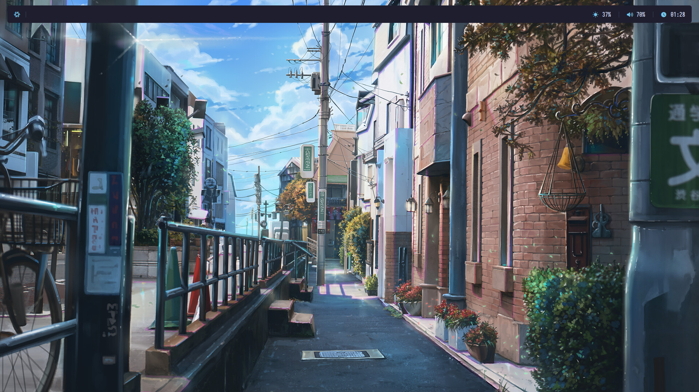
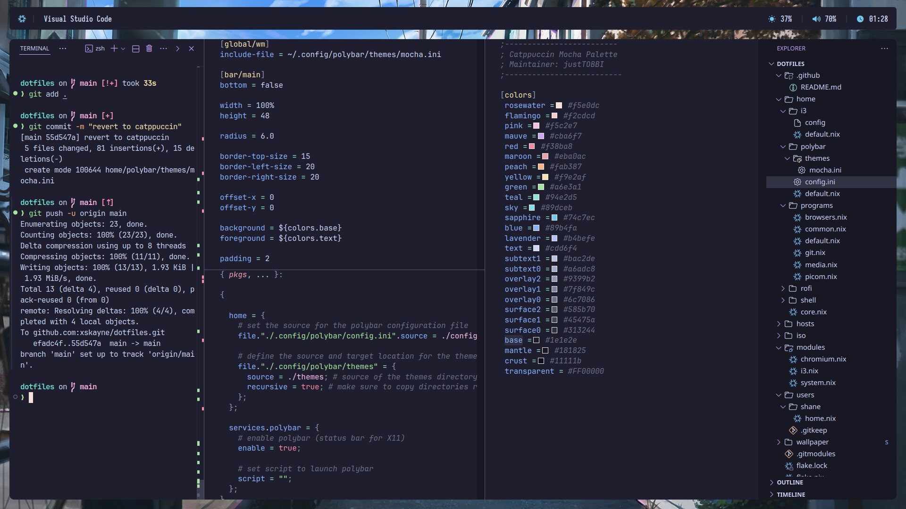

<p align="center">
	
</p>

<h2 align="center">xSKAYNE's Dotfiles</h2>

<p align="center">
	<a href="">
		
	</a>
	<a href="">
		
	</a>
	<a href="">
		
	</a>
</p>

This repository contains personal configuration(s) for setting up a system with NixOS using [Flakes](https://nixos.wiki/wiki/Flakes) & [Home Manager](https://nix-community.github.io/home-manager/).

## Why Nix?

Nix allows for an easy to manage, collaborative, reproducible deployment. This means that once something is setup and configured, it works forever. If someone else shares their configuration, anyone can make use of it.

## Components

|                             | **NixOS (X11)**                                                                            |
| --------------------------- | ------------------------------------------------------------------------------------------ |
| **Window Manager**          | [i3](https://github.com/i3/i3)                                                             |
| **Terminal Emulator**       | [Alacritty](https://github.com/alacritty/alacritty)                                        |
| **Bar**                     | [Polybar](https://github.com/polybar/polybar)                                              |
| **Application Launcher**    | [Rofi](https://github.com/davatorium/rofi)                                                 |
| **Notification Daemon**     | [Dunst](https://github.com/dunst-project/dunst)                                            |
| **Wallpapers**              | [Feh](https://github.com/derf/feh)                                                         |
| **Display Manager**         | [GDM](https://wiki.archlinux.org/title/GDM)                                                |
| **Network Management**      | [NetworkManager](https://wiki.gnome.org/Projects/NetworkManager)                           |
| **System Resource Monitor** | [htop](https://github.com/htop-dev/htop)                                                   |
| **File Manager**            | [Nemo](https://github.com/linuxmint/nemo)                                                  |
| **Shell**                   | [Starship](https://github.com/starship/starship)                                           |
| **Media Player**            | [Jellyfin](https://github.com/jellyfin/jellyfin), [mpv](https://github.com/mpv-player/mpv) |
| **Text Editor**             | [Visual Studio Code](https://github.com/microsoft/vscode)                                  |
| **Fonts**                   | [Nerd Fonts](https://github.com/ryanoasis/nerd-fonts)                                      |

## Preview

| Desktop                               | VSCode                              |
| ------------------------------------- | ----------------------------------- |
|  |  |

## Wallpaper

<p align="center">
	
    Wallpapers from <strong>Gwynsav</strong> | <a href="https://github.com/Gwynsav/walls">Repository</a>
</p>

## Hosts

See [hosts](../hosts) for details.

## ISO

See [iso](../iso) for details.

## How to deploy this flake?

> 🚨 **IMPORTANT**: **You should NOT deploy this flake directly on your machine(s). It will not succeed.** This flake contains my hardware configuration _(such as [hardware-configuration.nix](../hosts/ranni/hardware-configuration.nix) etc.)_ which is not suitable for your hardware.

For NixOS, use the following command(s):

```bash
git clone https://github.com/xskayne/dotslash
cd dotslash
nixos-rebuild switch --flake '.?submodules=1'#<host>
```

<small>In order for the wallpaper directory to be copied, `submodules=1` <u><strong>must</strong></u> be included due to it being a git submodule.</small>

For generating a custom image, use the following command:

```bash
cd iso
nix build .#nixosConfigurations.iso.config.system.build.isoImage -no-write-lock-file
```

## References

- [The Ultimate NixOS HomeLab Guide](https://jasperclarke.com/blog/nixos-homelab-the-install#setup-and-partitioning)
- [NixOS & Flakes Book](https://nixos-and-flakes.thiscute.world)

<small>Comments were generated by throwing my very messy <i>([xkcd](https://xkcd.com/1513/))</i> configuration at [ChatGPT](https://chatgpt.com/). I am far too lazy to write documentation... <strong>TODO:</strong> <i>Be better</i>.</small>
